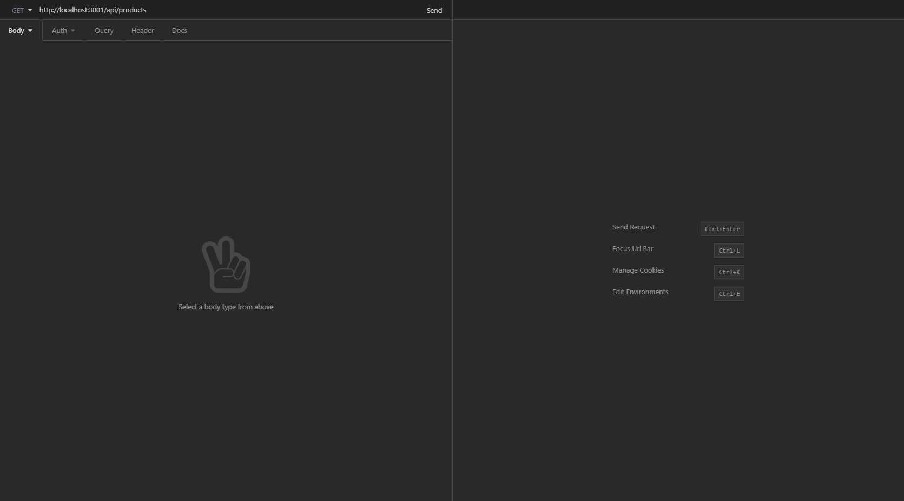

# E-Commerce-Server

## Description

Utilizing sequelize, express, mysql2 to create a database that can get, add, update, and delete data through API platform like Postman and Insomnia.

## Table of Contents

- [Create Database](#Create-Database)
- [Start Application](#Start-Application)
- [GET](#get)
- [POST](#post)
- [PUT](#put)
- [DELETE](#delete)

## How To

Below are instuction on how to run the software.

### Create Database

Create Schema from MySQL shell and seed database from command line

### Start Application

### GET

### POST

### PUT

### DELETE

